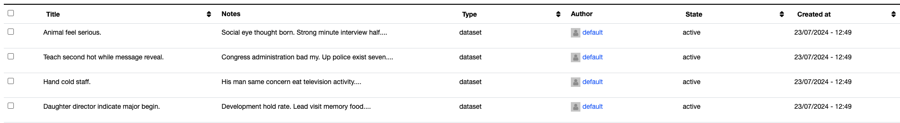

# Column Renderers

We're using column renderers to display the data in a more user-friendly way using the `ckanext-collection`. The extension provides a few built-in renderers, but you can also create your own custom renderers and register it with an interface provided by the extension. See the [interface](./../interfaces.md) documentation for more information.

See the example below, where we're using the `date` renderer to display the date in a more readable format, and a `user_link` renderer that recieves a user ID and returns a link to the user profile page with a placeholder avatar.

### In-built renderers

::: ap_main.col_renderers
    options:
      show_source: true
