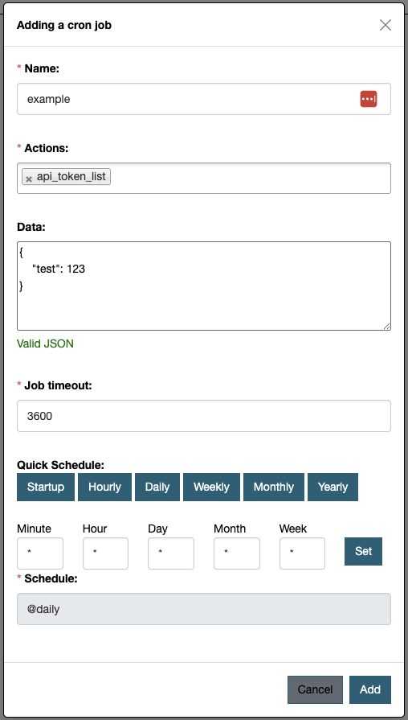

### Scheduling
Each cron job can be manually triggered from the cron manager page. However, it's essential to schedule a single command with crontab to automatically trigger all jobs created within CKAN. For example:
    ```ini
    */10 * * * * /usr/lib/ckan/default/bin/ckan -c /etc/ckan/default/production.ini ap-cron trigger-jobs
    ```

This command checks all the jobs every 10 minutes to determine if they should be run again. Without scheduling this command, you can manually initiate a specific job through the user interface by clicking the `Run` button. Alternatively, you can execute all scheduled jobs by clicking the `Run active jobs` button.

### Create cron job
To create a cron job, navigate to the cron manager page and click the `Add cron job` button.



Each job must include the following components:

- Name: A label used primarily in the UI for identification.
- Actions: One or more CKAN actions that will be executed.
- Data: JSON-formatted data that provides arguments to the initial action.
- Job Timeout: The maximum duration allowed for a job to run before it is deemed to have failed.
- Schedule: A cron expression that specifies the frequency and timing of the job execution.

???+ info
    It is important to note that console commands are not permitted within cron jobs for security reasons. Instead, only CKAN actions can be executed. You can chain multiple actions together; each subsequent action will receive the result of the previous one as its arguments.
