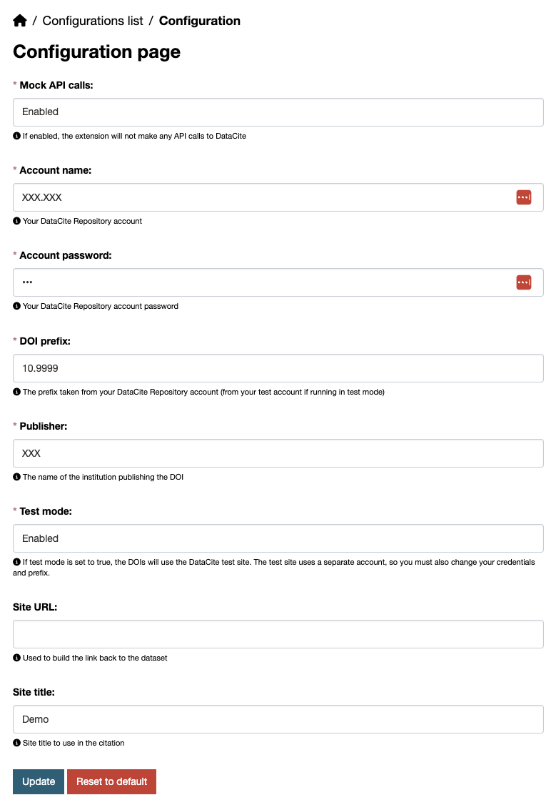

The extension allows you to configure the DOI extension via the UI. The configuration options are the same as the ones available in the `ckanext-doi` plugin.

Plus, we're adding a config option to enable/disable the DOI feature. As the original extension doesn't allow us to create/update datasets without proper credentials, we've added a Mock API calls option to avoid the issue. It might be useful for testing purposes using a local environment.

