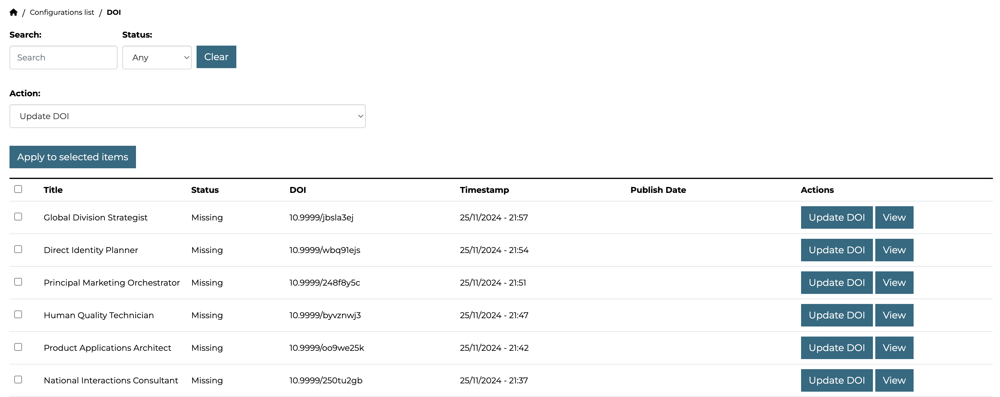

The `admin_panel_doi` extension adds a DOI support to the CKAN datasets. For this, you'll have to add a field to the dataset schema and configure the plugin.

## Updating the dataset schema

The `admin_panel_doi` adds a scheming preset that you can use to add a DOI field to the dataset schema:

```yaml

```

Follow the instructions below to add the DOI field to your dataset schema:

1. First of all, specify a scheming preset file in the CKAN configuration file. For example, add the following line to the `development.ini` file:

    ```ini
    scheming.presets = ... ckanext.ap_doi:presets.yaml
    ```

2. Add a new field to your dataset schema:

    ```yaml
    - preset: ap_doi
    ```

## Dashboard

This dashboard provides comprehensive tools to manage datasets DOI efficiently. It offers functionality for listing, searching, updating, and filtering datasets based on their DOI status, with a user-friendly and high-performance AJAX-powered interface.

Features:

1. **DOI Management**. Update DOI for a single dataset or multiple datasets in bulk.
2. **Search Functionality**. Quickly search for datasets by their title.
3. **Filtering Options**. Filter datasets by their DOI status to focus on specific categories:
    * Missing
    * Outdated
    * Published
4. **Pagination Support**. Efficiently navigate large lists of datasets using pagination for improved performance and usability.
5. **High Performance**. Built with AJAX for faster interactions and seamless updates without full-page reloads.



