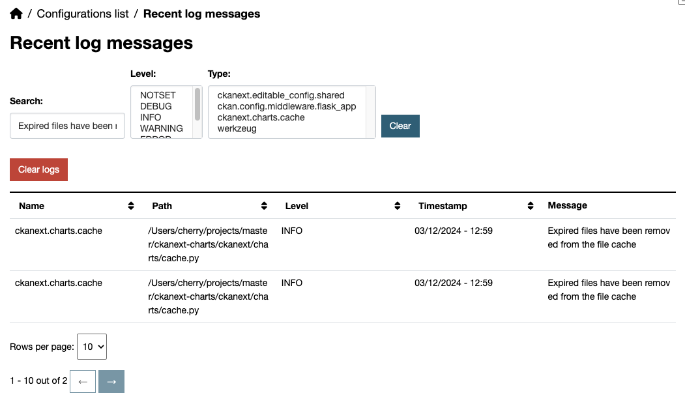
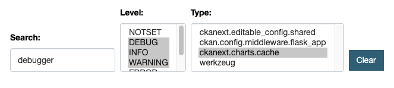

After you have set up the logging handler, you can access the logs through the admin panel. The logs are displayed in a table with the following columns:

- **Name**: The name of the logger that generated the log message.
- **Path**: The path to the module that generated the log message.
- **Level**: The log level of the message.
- **Timestamp**: The time when the log message was generated. Format: `DD/MM/YYYY - HH:MM`.
- **Message**: The log message itself.

### Filters

Fitler widget allows you to filter logs by different criterias:

- **Search**: Filter logs by the message content.
- **Level**: Filter logs by one or multiple levels.
- **Type**: Filter logs by one or multuple log names.
