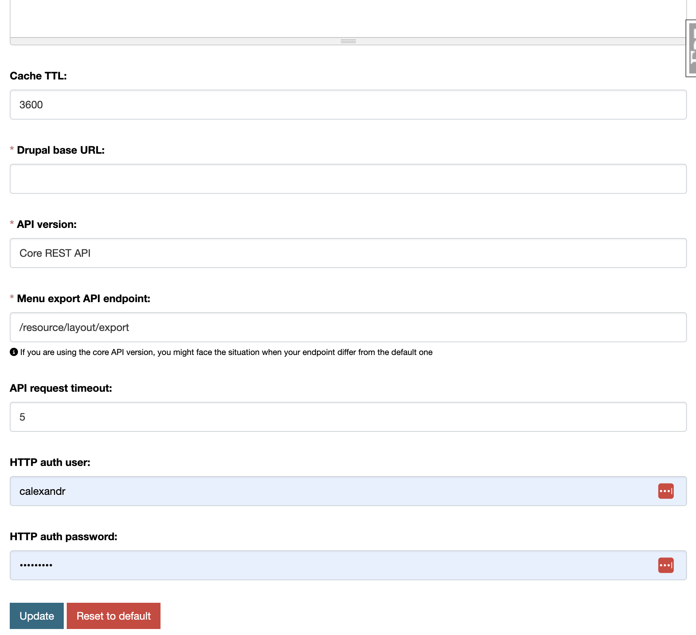

# Register configuration page

One of the admin panel feature is the ability to easily create a configuration page for your extension.

The `ckanext-admin-panel` introduces a generic view that can be used to create a configuration page for your extension. This gives us the following benefits:

- The configuration form is generated based on the schema you define. It's fast and easy to create a configuration page.
- The values submitted in the form are stored in the database with `ckanext-editable-config`, so you don't have to worry about handling the configuration values yourself.
- It's easy to change and maintain the configuration schema.
- The configuration depends on config declaration - a native CKAN feature. You decide if the configuration option could be edited in a runtime or not.
- You can use regular CKAN validators in your config declaration to validate the configuration values.
- You can reset the configuration to the default values (if the default value is specified in the config declaration).



???+ note
    You define the URL where the configuration page will be available. We suggest to use a `/admin-panel/example` prefix for your bluepritn, where `example` is a name of your plugin. E.g. `/admin-panel/example/config`.

???+ note
    The configuration form will be generated based on the schema you defined in the `config_schema.yaml` file.

???+ warning
    The values submitted in the form will be stored in the `editable_config_option` table in the database. Make sure to use the `ckanext-editable-config` extension.

## Registering a configuration page

### Defining the config declaration

The configuration declaration is a `yaml` file that defines the configuration fields for your extension. This allows to validate the current configuration against the declaration, or check which config options in the CKAN config file are not declared (and might have no effect). Refer to the [CKAN documentation](https://docs.ckan.org/en/latest/maintaining/configuration.html#config-declaration) for more information, as we're not going to describe it in detail here.

Register a `config_declaration.yaml` file in your extension directory. See the example below:

```yaml

```

### Defining the configuration schema

The configuration schema is a YAML file that defines the configuration fields for your extension. The schema follows the same format as the `ckanext-scheming` schema.

Create a `config_schema.yaml` file in your extension directory. See the example below, where we use the configuration key as a `field_name`:

```yaml

```

### Register the config section and your schema

We're using the `ISignal` interface to register the configuration section and the schema file.

```python
# ISignal

def get_signal_subscriptions(self) -> SignalMapping:
    return {
        tk.signals.ckanext.signal("ap_main:collect_config_sections"): [
            self.collect_config_sections_subscriber,
        ],
        tk.signals.ckanext.signal("ap_main:collect_config_schemas"): [
            self.collect_config_schemas_subs
        ],
    }

@staticmethod
def collect_config_sections_subscriber(sender: None):
    return ap_types.SectionConfig(
        name="Admin panel example",
        configs=[
            ap_types.ConfigurationItem(
                name="Example settings",
                blueprint="ap_example.config",
                info="An example of schema-generated configuration form",
            ),
            ap_types.ConfigurationItem(
                name="Example display",
                blueprint="ap_example.display",
                info="Example of displaying values submitted from a form",
            ),
        ],
    )

@staticmethod
def collect_config_schemas_subs(sender: None):
    return ["ckanext.ap_example:config_schema.yaml"]
```

### Register the blueprint

Refer to the CKAN documentation if you have any problems with registering a blueprint.

1. Implement the `IBlueprint` interface in your extension or use the `blanket` for a shortcut (CKAN 2.10+).

    ```python
    class AdminPanelExamplePlugin(p.SingletonPlugin):
        p.implements(p.IBlueprint)

        def get_blueprint(self):
            return ...
    ```

    or

    ```python
    @tk.blanket.blueprints
    class AdminPanelExamplePlugin(p.SingletonPlugin):
        ...
    ```

2. Create `views.py` file in your extension's directory and define the views for your configuration page.
    See example below, where we use the `schema_id` from the config schema we defined.

    ```python
    from flask import Blueprint

    from ckanext.ap_main.utils import ap_before_request
    from ckanext.ap_main.views.generics import ApConfigurationPageView


    log = logging.getLogger(__name__)
    ap_example = Blueprint("ap_example", __name__, url_prefix="/admin-panel/example")
    ap_example.before_request(ap_before_request)

    ...

    ap_example.add_url_rule(
        "/config",
        view_func=ApConfigurationPageView.as_view("config", "admin_panel_example_config"),
    )
    ```

3. This will generate a configuration page for your extension in the admin panel.
