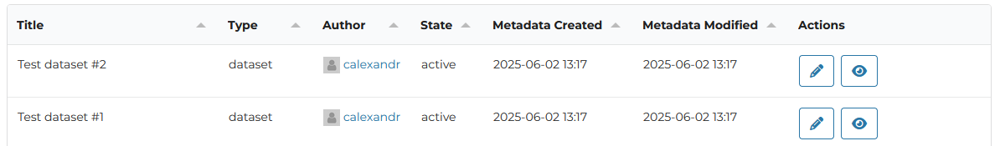

# Formatters

We're using formatters to display the data in a certain way. The extension provides a few built-in formatters, but you can also create your own custom formatters and register it with an interface provided by the extension. See the [interface](./../interfaces.md) documentation for more information.

See the example below, where we're using the `date` formatter to display the date in a more readable format, and a `user_link` formatter that recieves a user ID and returns a link to the user profile page with a placeholder avatar.

### In-built renderers

::: ap_main.formatters
    options:
      show_source: true
